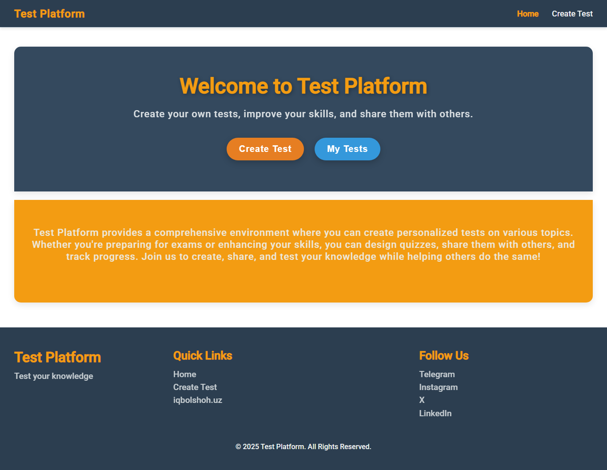
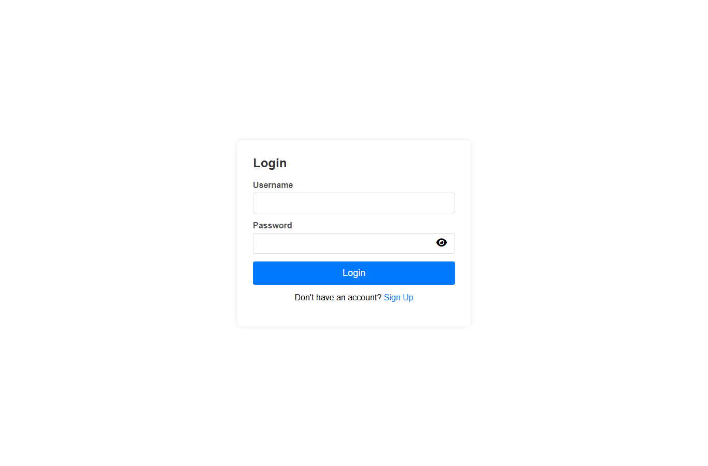
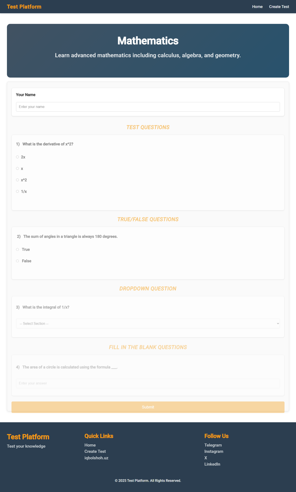
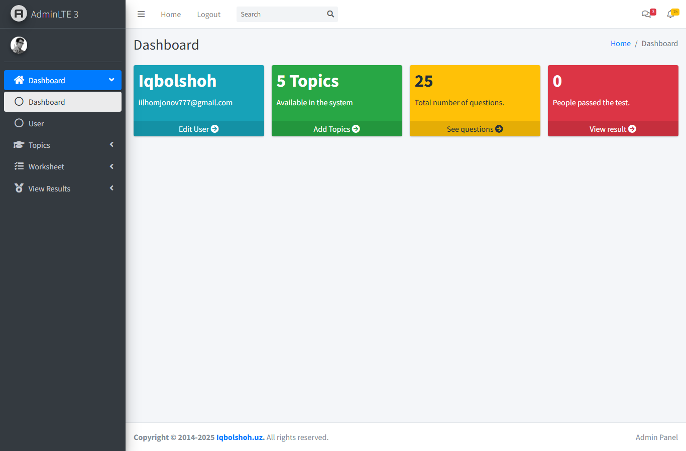

# 📝 PHP Test Platform

**PHP Test Platform** is a full quiz-creation and testing web app: registered users can build subjects made up of **five different question formats** — multiple choice, true/false, dropdown, fill-in-the-blank, and matching — and share a public link so anyone can take the quiz and get scored instantly. It includes session-based authentication with multi-device session management and an **AdminLTE-powered admin panel** for managing subjects, questions, and results.

<p align="left">
  
  
  
</p>



## 📚 Table of Contents

- [Features](#-features)
- [Screenshots](#-screenshots)
- [Demo Account](#-demo-account)
- [Project Structure](#-project-structure)
- [Requirements](#-requirements)
- [Installation Guide](#️-installation-guide)
- [Technologies Used](#-technologies-used)
- [License](#-license)
- [Contributing](#-contributing)
- [Connect with Me](#-connect-with-me)

## ✨ Features

### 1️⃣ Five Question Formats 📋
✅ **Multiple choice** — question with any number of options and one correct answer.
✅ **True / False** — quick statement-based questions.
✅ **Dropdown** — pick the correct answer from a select list.
✅ **Fill in the blank** — free-text answer, matched case-insensitively.
✅ **Matching** — pair a left-side term with its right-side value.

### 2️⃣ Shareable Public Quizzes 🔗
✅ Every subject gets a clean, unique URL slug (e.g. `/test.php?url=mathematics`).
✅ Anyone with the link can take the quiz — no account required.
✅ Instant scoring with a percentage breakdown on submit.

### 3️⃣ Authentication & Sessions 🔐
✅ Signup/login with hashed passwords and CSRF-protected forms.
✅ Persistent login via secure cookies.
✅ **Multi-device session tracking** — see every device you're logged in on and revoke any of them.

### 4️⃣ Admin Panel 🛠️
✅ **AdminLTE 3** dashboard with live stats (subjects, total questions, participants).
✅ Create, edit, and delete subjects and every question type.
✅ Review quiz results per subject, with participant name and score.

## 📸 Screenshots

**Login**


**Taking a Quiz**


**Admin Dashboard**


## 🛠 Demo Account

| 👤 Username  | 🔑 Password    |
|:-------------|:----------------|
| `iqbolshoh`  | `Iqbolshoh$7`    |

## 📂 Project Structure

```
php-test-platform/
├── login/, signup/, logout/    # Auth pages (signup/check_availability.php backs live validation)
├── user/                       # Admin panel (AdminLTE) — protected by auth.php
│   ├── topics.php               # Manage subjects (auto-generates the public URL slug)
│   ├── test.php, true_false.php, dropdown.php,
│   │   fill_in_the_blank.php, matching.php   # One CRUD page per question format
│   ├── results.php              # Per-subject quiz results
│   ├── active_sessions.php      # Multi-device session management
│   └── includes/                # Shared navbar, footer, css/js includes for the admin panel
├── src/css/, src/js/, src/images/
├── config.php                   # DB connection + tiny query-builder helper class
├── database.sql                 # Schema + demo data (5 subjects, 25 questions, demo user)
├── header.php, footer.php       # Public site layout
├── index.php                    # Public homepage
└── test.php                     # Public quiz-taking page (/test.php?url=<slug>)
```

## 📋 Requirements

- PHP **7.4+** (with the `mysqli` extension enabled)
- MySQL / MariaDB
- Apache or Nginx (or PHP's built-in server for local testing)

## ⚙️ Installation Guide

### 1️⃣ Clone the repository
```bash
git clone https://github.com/Iqbolshoh/php-test-platform.git
cd php-test-platform
```

### 2️⃣ Import the database
`database.sql` creates the `test_platform` database, all tables, and seed data in one go:
```bash
mysql -u yourusername -p < database.sql
```

### 3️⃣ Configure the database connection
Open **`config.php`** and update the credentials if they differ from the defaults:
```php
define("DB_SERVER", "localhost");
define("DB_USERNAME", "root");
define("DB_PASSWORD", "");
define("DB_NAME", "test_platform");
```

### 4️⃣ Run the application
```bash
php -S localhost:8000
```
Then open **`http://localhost:8000`** in your browser (or deploy to Apache/Nginx as usual).

## 🖥 Technologies Used


## 📜 License
This project is open-source and available under the [MIT License](./LICENSE).

## 🤝 Contributing
🎯 Contributions are welcome! If you have suggestions or want to enhance the project, feel free to fork the repository and submit a pull request.

## 📬 Connect with Me
💬 I love meeting new people and discussing tech, business, and creative ideas. Let's connect! You can reach me on these platforms:

<div align="center">

[](https://iqbolshoh.uz)
[](mailto:iilhomjonov777@gmail.com)
[](https://github.com/iqbolshoh)
[](https://www.linkedin.com/in/iqbolshoh)
[](https://t.me/+998776030033)
[](https://www.instagram.com/iqbolshoh_777)
[](https://x.com/iqbolshoh_777)

</div>
